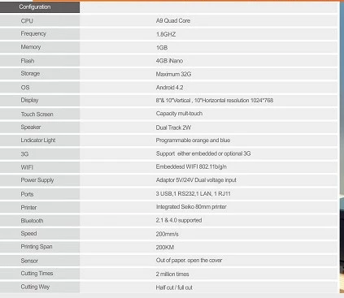

# Citaq H10 Root & Knowledge Base


My knowledge repository for my research on Citaq H10-3 Android All-in-one (Menulog Order Device/JustEat Order Device).

This is an attempt to consolidate the information I've found on the internet regarding these devices in order to help others in the future.

If theres something missing which you'd like to add, raise an issue on the github repo https://github.com/orbing/citaq/issues.

---

# Useful Info

## Citaq H10-3 Spec (Menulog-AU Order Device)

<details>
<summary> Click Here For Original Spec Screenshot that this was transcribed from </summary>

</details>

* CPU : A9 Quad Core
* Freqency : 1.8GHZ
* Memory : 1GB
* Flash : 4GB Nano
* Storage : Maximum 32G
* OS : Android 4.2 (Later models also include Android 5.1.1)
* Display : 8"& 10"Vertical , 10"Horizontal resolution 1024*768
* Touch : Screen Capacitive multi-touch
* Speaker: Dual Track 2W
* Indicator Light  : Programmable orage and blue
* 3G : Supports either embedded or optional 3G
* Wifi : Embedded WIFI 802.11b/g/n
* Power Supply : Adapter 5V/24V dual voltage input
* Ports : 3 USB, 1 RS232, 1 LAN, 1 RJ11
* Printer : Integrated Seiko 80mm printer
* Bluetooth : 2.1 & 4.0 Supported
* Speed : 200mm/s
* Printing Span : 200KM
* Sensor : Out of paper, open the cover
* Cutting Times 2 million times
* Cutting way : Half cut / full cut

## Rebooting into Recovery ROM 
So it seems citaq have included some sort of recovery ROM once you wipe the device. As you would expect, it includes an oudated copy of Soti MobiControl software, a factory app to test the device, standard android utilities and a simple APK management utility. The factory app had a few more features than I was expecting but hinted nothing towards an SDK (I was being very hopeful.) I will include a copy of the factory app in the "software" folder in this repo.

---

# Factory resetting CITAQ H10

**Im using the H10-3 (Menulog-AU Order Device)**
**Careful, this process may be different for you.**

This is what I did to reimage my device to recovery:

<details>
<summary> Click Here For Steps </summary>

1. Open and lift the top panel. Extend completely - use caution and take it slow. Move the thermal paper roll out of the way.
    -  
2. On the underside of the top panel, find a small grey rectangle that contains the words "SIM Card" and "TF Card". Uscrew this.
    -  
3. While powered-off, locate the button under this panel that reads "Recovery" (Silkscreen Reads: `RECOVER`).
    -  
4. Hold the "Recovery" button while powering-on the device - do not let go until you see the recovery menu.
    - 
6. Plug-in a USB keyboard. Navigate to and select, "Format/Wipe Cache" and "Format/Wipe System".
    - If using mouse, then move mouse up and down to move up and down and the `RECOVER` button to press enter.
7. Navigate to "Reboot"

From this point the device should have successfully been reimaged from recovery ROM.

</details>

---

I after doing this I have found Bluetooth, WiFi & Ethernet to be very buggy. I decided to look at the TF card that was attached to the device. I saw there was a copy of the MobiControl software and a random APN package. I installed the APN package and the network & wireless issues persist. I'm currently looking for solutions and/or hardware drivers on the internet (just need to crack open the device and get a few part numbers now).

I also am looking into rooting the device manually.

####  Advice found at: https://leeatljs.blogspot.com/2020/10/factory-reset-citaq-h10.html (Comments section)
1. Go To Just Eat WiFi Settings - Go To Top Right Add Network
2. It Will then try to load their Mobile Control App
3. Go To Bottom left the Return Curly Arrow
4. keep hitting it until iy takes you to the normal start page
5. Go to Settings > Apps
6. Uninstall all Just Eat Apps - there are about 4
7. Then Go to do reset

## Rooting the device
Rooting the device desent seem too difficult to do manually. The OS runs android version 5.1.1 and doesnt seem to have the ability to recieve security updates automatically (an issue im keen to address, also the posibilty in updating the OS to a newer version). 

#### ADB/USB Drivers
Ive inclded the adb "usb drivers" I found online and anti-virus says they're clean. There is also a rockchip driver, as the page I downloaded them from refers to these as the chipset drivers, so they may become handy in the future. I'm not sure if the rockchip drivers are the correct ones as I am running a H10-3 - newer model device. https://gsmmobiledriver.com/citaq-h10

## Ionic Capacitor Plugin

Capacitor plugin for printing to the H10 thermal printer from inside Ionic Web App. 
https://www.npmjs.com/package/capacitor-plugin-serialprinter

https://github.com/realashleybailey/capacitor-plugin-serialprinter

- **Credit: realashleybailey**

---

## Printer Demo Ouput

When using POSFactory app and you press the print self test, this is what you may read.
This contains useful information on how to communicate to the serial printer that is connected internally via serial port.

Note that the serial port is configured as 

* Model: CTE-RP80 (80mm Printer)
* Version: 5.62
* Command mode: Print speed: ESC/POS 200m (max)
* Characters Per Line:       48
* Auto Cutter:               Yes
* Beeper:                    Yes
* Auto clear buffer:         No
* NV bit image:              No
* Serial:                    115200, None, 8, 1, DTR/DSR

<details>
<summary>Click to expand the raw OCRed text, with other detailed information that may be of relevance to developers</summary>
	
```
CTE-RP80 
80mm Printer

Version:                   5.62
Command mode: Print speed: ESC/POS 200m (max)
Characters Per Line:       48
Auto Cutter:               Yes
Beeper:                    Yes
Auto clear buffer:         No
NV bit image:              No
Serial:                    115200, None, 8, 1, DTR/DSR

Resident Character: 
	Alphanumeric
	GBK 中文字特集
	BIG5體中文字符集
	KSC5601

Chinese character mode:      No
International character set: U.S.A. 
Default code page:           page0
Character code table:
	page 0 (PC437:Standard-Europe)
	page 1 (Katakana)
	page 2 (PC850:Multilingual)
	page 3 (PC860:Portuguese)
	page 4 (PC863:Canadian French) 
	page 5 (PC865:Nordic)
	page 6 (West-Europe)
	page 7 (Greek)
	page 13 (PC857 Turkish)
	page 14 (PC737:Greek)
	page 15 (PC928:Greek)
	page 16 (WPC1252)
	page 17 (PC866:Cyrillic#2)
	page 18 (PC852:Latin2) 
	page 19 (PC858:Euro)
	page 21 (PC874)
	page 33 (WPC775: Baltic Rim)
	page 34 (PC855:Cyrillic)
	page 36 (PC862:Hebrew)
	page 37 (PC864: Arabic)
	page 41 (PC1098:Farsi)
	page 46 (WPC1251:Cyrillic)
	page 47 (WPC1253:Greek)
	page 48 (WPC1254:Turkish)
	page 49 (WPC1255:Hebrew)
	page 50 (WPC1256:Arabic)
	page 51 (WPC1257: Baltic Rim)
	page 74 (Gujarati)
	page 254 (UTF-8)
```

</details>

- **Credit: [mofosyne](https://github.com/mofosyne)**

---

## Print Proxy

This app works great as an interface between the in-built serial (thermal) printer and your device. It costs Euro14.99 and works as it says on the website. https://citaq.co.uk/

Ive included the most up to date version avaliable. See "Software' folder.

---

## SDK
A kind user of reddit has contacted the device maker Citaq and has forwarded on the Software Development Kit to us.

---

## Disclaimer
I am not affiliated in anyway with Citaq or Menulog(AU)/JustEat(Int). I do not endorse modifying your device as it may void any and all warranties that the device may have had prior. This may also be a breach in your Menulog(AU)/JustEat(Int) contract (if you are a resturant partner), so please proceed with caution.
