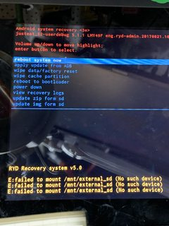

# Factory resetting CITAQ H10

**Note that I am using the H10-3 (Menulog-AU Order Device)**

**Becareful, this process may be different for you.**

This is what I did to reimage my device to recovery:

1. Open and lift the top panel. Extend completely - use caution and take it slow. Move the thermal paper roll out of the way.
    -  
2. On the underside of the top panel, find a small grey rectangle that contains the words "SIM Card" and "TF Card". Uscrew this.
    -  
3. While powered-off, locate the button under this panel that reads "Recovery" (Silkscreen Reads: `RECOVER`).
    -  
4. Hold the "Recovery" button while powering-on the device - do not let go until you see the recovery menu.
    - 
6. Plug-in a USB keyboard. Navigate to and select, "Format/Wipe Cache" and "Format/Wipe System".
    - If using mouse, then move mouse up and down to move up and down and the `RECOVER` button to press enter.
7. Navigate to "Reboot"

From this point the device should have successfully been reimaged from recovery ROM.
